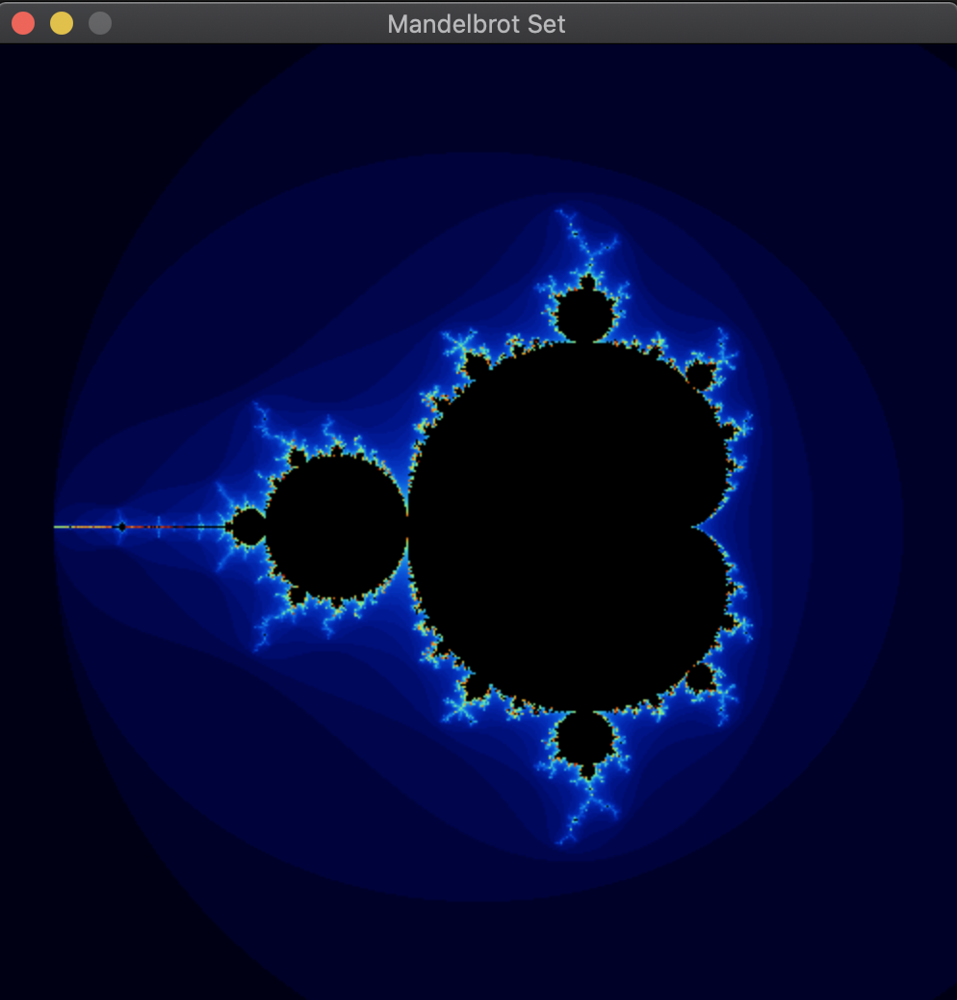
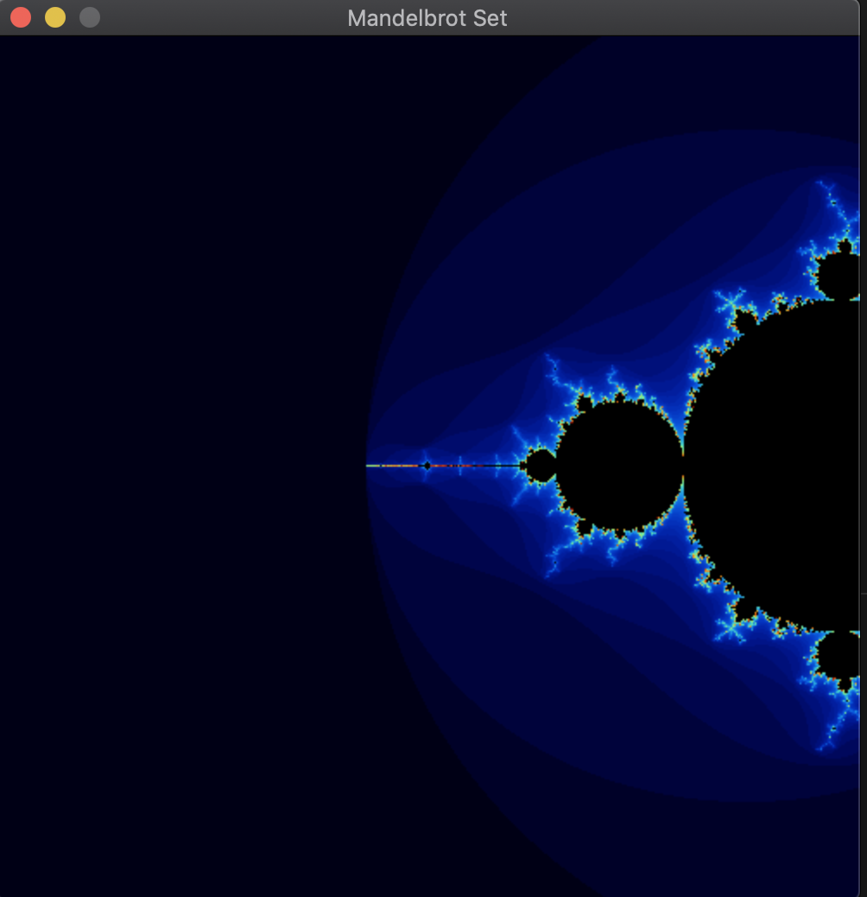

# Mandelbrot Set: C++ Nanodegree Capstone Project

This is a rendering of the Mandelbrot set.  This project is adapted from the tutorial [Solarian Programmer](https://solarianprogrammer.com/2013/02/28/mandelbrot-set-cpp-11/).

Zooming in on the Mandelbrot set illustrates its infinitely complex pattern.  This boundary is a fractal curve, meaning that regardless of the level of magnification, the curve retains the same general pattern of irregularity.  For more information, please refer to [Wolfram MathWorld](https://mathworld.wolfram.com/MandelbrotSet.html) or [Wikipedia](https://en.wikipedia.org/wiki/Mandelbrot_set).

To learn more about how SDL2 is used in this project, please refer to the SDL2 tutorial [TwinklebearDev](https://www.willusher.io/pages/sdl2/) and the SDL2 library keyboard documentation [Handling the Keyboard](https://www.libsdl.org/release/SDL-1.2.15/docs/html/guideinputkeyboard.html).

When you start the program, the display looks like this:

<p align="center">

</p>


When the program is running, you can recenter the display to a new location by using the <kbd>Mouse</kbd> to click on on any point in the display:

<p align="center">

</p>

## Dependencies for Running Locally
* cmake >= 3.11.3
  * All OSes: [click here for installation instructions](https://cmake.org/install/)
* make >= 4.1 (Linux, Mac), 3.81 (Windows)
  * Linux: make is installed by default on most Linux distros
  * Mac: [install Xcode command line tools to get make](https://developer.apple.com/xcode/features/)
  * Windows: [Click here for installation instructions](http://gnuwin32.sourceforge.net/packages/make.htm)
* gcc/g++ >= 5.4
  * Linux: gcc / g++ is installed by default on most Linux distros
  * Mac: same deal as make - [install Xcode command line tools](https://developer.apple.com/xcode/features/)
  * Windows: recommend using [MinGW](http://www.mingw.org/)
* SDL2 >= 2.0.12
  * All OSecs: [click here for installation instructions](https://wiki.libsdl.org/Installation)
  * Mac: can also install with brew: `brew install sdl2` and use pkg-config to set compile flags and library options: `pkg-config --cflags --libs sld2`.
  * Linux and Windows: for more information, please refer to this tutorial: [Using sdl2 with cmake](https://trenki2.github.io/blog/2017/06/02/using-sdl2-with-cmake/).

## Basic Build Instructions

1. Clone this repo.
2. Make a build directory in the top level directory: `mkdir build && cd build`
3. Compile: `cmake .. && make`
4. Run it: `./mandelbrot_set`.


## Directory Structure
```bash
.
├── CMakeLists.txt # build configuration
├── README.md
├── .gitignore
├── images # images used in README.md
├── src
│   └── display.cpp # encapsulates rendering of SDL2 display
│   └── display.h
│   └── main.cpp
│   └── mandelbrot.cpp # namespace of related mathematical functions 
│   └── mandelbrot.h
│   └── pixel_queue.cpp #  data structure that stores pixels
│   └── pixel_queue.h
│   └── pixel.cpp # representation of single pixel
│   └── pixel.h
│   └── window.h
```
## Rubric

| Section  |  Criteria|  Details |
|---|---|---|
| Loops, Functions, I/O | The project demonstrates an understanding of C++ functions and control structures. | A variety of control structures are used in this project.  For example, a selection flow of control is implemented in the **display** class's member function ***initializeEventQueue*** via a switch statement. A repetition control struture is implemented in the **pixel queue** constructor via nested for loops.  The project code is clearly organized into functions. |
| Loops, Functions, I/O | The project reads data from a file and process the data, or the program writes data to a file. | n/a  |
| Loops, Functions, I/O | The project accepts user input and processes the input. | n/a  |
| Object Oriented Programming | The project uses Object Oriented Programming techniques.  | The project code is organized into classes with class attributes to hold the data, and class methods to perform tasks (e.g. **pixel.h**, **pixel_queue.h**, **display.h**, and **window.h**). |
| Object Oriented Programming | Classes use appropriate access specifiers for class members.  | All class data members are explicitly specified as public, protected, or private.  For example, all class member variables are explicitly specified as private. |
| Object Oriented Programming | Class constructors utilize member initialization lists.  | All class members that are set to argument values are initialized through member initialization lists (e.g. **pixel.h**, **pixel_queue.h**, **display.h**, and **window.h**).    |
| Object Oriented Programming | Classes abstract implementation details from their interfaces.  | All class member functions document their effects via both function names and comments. Member functions do not change program state unless documented (e.g. all class setters and ***popBack*** member function in **pixel queue** class). |
| Object Oriented Programming | Classes encapsulate behavior.  | Appropriate data and functions are grouped into classes (e.g. a pixel has a color and location).  Member data that is subject to an invariant is hidden from the user (e.g. a window's width must be positive).  |
| Object Oriented Programming | Classes follow an appropriate inheritance hierarchy.  | n/a  |
| Object Oriented Programming | Overloaded functions allow the same function to operate on different parameters.  | In the **window** class, functions are overloaded with different signatures for the same function name (specifically, setters and getters). |
| Object Oriented Programming | Derived class functions override virtual base class functions.  | n/a |
| Object Oriented Programming | Templates generalize functions in the project.  | The **window** class is a template, where member functions accept generic parameters.  For example, please refer to the constructor. |
| Memory Management | The project makes use of references in function declarations.  | Functions in the project use pass by reference (e.g. functions ***bernsteinRed*** and ***bernsteinBlue*** in the namespace **Mandelbrot**).  |
| Memory Management | The project uses destructors appropriately.  | The **display** class modifies state upon termination of an object via a destructor.  |
| Memory Management | The project uses scope / Resource Acquisition Is Initialization (RAII) where appropriate.  | The project follows the Resource Acquisition Is Initialization pattern where appropriate, by allocating objects at compile-time, initializing objects when they are declared, and utilizing scope to ensure their automatic destruction.  For example, smart pointers are declared and initialized in the program's main function. These resources are automatically released when the program terminates.   |
| Memory Management | The project follows the Rule of 5.  | In the display class, the no copy policy is implemented.  |
| Memory Management | The project uses move semantics to move data, instead of copying it, where possible.  | Please refer to the member function ***pushBack*** in the **pixel queue** class as an example.  |
| Memory Management | The project uses smart pointers instead of raw pointers.  | A shared pointer named *fractal* is declared and initialized in the main function.  The display object also owns this resource. All pixels hold a non-owned data handle to this object.  |
| Concurrency | The project uses multithreading.  | n/a  |
| Concurrency | A promise and future is used in the project.  | n/a  |
| Concurrency | A mutex or lock is used in the project.  | n/a  |
| Concurrency | A condition variable is used in the project.  | n/a  |


